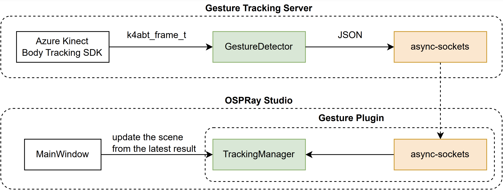

# Immersive OSPRay Studio
> This project is part of a larger project called [Immersive OSPray](https://github.com/jungwhonam-tacc/Whitepaper).

We extend [OSPRay v2.10.0](https://github.com/ospray/ospray/releases/tag/v2.11.0) to display a single, coherent 3D virtual environment on tiled display walls and use gesture-based interaction techniques to navigate the environment. We provide another mode of running the application with the ability to open multiple windows and coordinate these windows (see [MULTIWINDOWS Mode](#multiwindows-mode)). We provide gestured-based interaction techniques by integrating a separate server application sending tracking user data to a plugin to the rendering application (see [Gesture Plugin](#gesture-plugin)).

# Build and Run
## CMake configuration and build
```
git clone https://github.com/jungwhonam-tacc/ospray_studio.git
cd ospray_studio

git checkout v0.12.0-alpha.x

mkdir build
cd build
mkdir release

cmake -S .. \
-B release \
-DCMAKE_BUILD_TYPE=Release \
-DUSE_PYSG=OFF \
-DUSE_MPI=ON \
-DBUILD_PLUGINS=ON \
-DBUILD_PLUGIN_GESTURE=ON \
-Dospray_DIR="/Users/jnam/Documents/Test/ospray/build/release/install/ospray/lib/cmake/ospray-2.10.0"

cmake --build release -- -j 5

cmake --install release
```
OSPRay Studio needs to be built with ```-DUSE_MPI=ON```, ```-DBUILD_PLUGINS=ON```, and ```-BUILD_PLUGIN_GESTURE=ON``` in CMake. Also, we need to use [OSPRay we have customized](https://github.com/jungwhonam-tacc/ospray). After building the OSPRay, set ```ospray_DIR``` so CMake can locate OSPRay, e.g., ```/Users/jnam/Documents/GitHub/ospray/build/install/ospray/lib/cmake/ospray-2.10.0```.

## Run the application
```
mpirun -n 3 \
./ospStudio \
multiwindows \
--mpi \
--displayConfig config/display_settings.json \
--scene multilevel_hierarchy \
--plugin gesture \
--plugin:gesture:config config/tracking_settings.json
```

```multiwindows```: This option activates our custom mode.

```--mpi```: This option enables the OSPRay Studio's built-in MPI support, which is a required dependency of our custom mode.

````--displayConfig config/display_settings.json````: The JSON configuration file contains information about off-axis projection cameras and windows. Information in the file is used to position and scale windows. See [Display Configuration JSON File](https://github.com/jungwhonam-tacc/ConfigurationGenerator#1-display-configuration-json-file) for details on the JSON file.

```--scene multilevel_hierarchy```: This option starts the application with the scene opened (optional).

```--plugin gesture```: This option starts the application with the gesture plugin.

```--plugin:gesture:config config/tracking_settings.json```: The JSON configuration file contains information about the gesture tracking server and user tracking data. Gesture Plugin uses this file. See [Implementation details](#implementation-details) for details on the JSON file.

> See [example-config](/example-config/) for example JSON files.

# MULTIWINDOWS Mode
OSPRay Studio provides different modes of running the application. We added another mode called ```MULTIWINDOWS```; the mode is similar to the default ```GUI``` mode with these additional features: 1) Position and scale windows based on MPI ranks and 2) Synchronize MPI processes.

> See ```app/MultiWindows.cpp```. To implement the mode, we copied and modified ```app/MainWindow.cpp```. 

### 1. Position and scale windows based on MPI ranks
This new OSPRay Studio mode takes a command line option, ```--displayConfig```, which points to a JSON configuration file that specifies windows and off-axis cameras. At the start of the application, the JSON file is loaded, and values get stored in a JSON object ```nlohmann::ordered_json configDisplay```. Positioning and scaling GLFW windows are done in a constructor.

> See [Display Configuration JSON File](https://github.com/jungwhonam-tacc/ConfigurationGenerator#1-display-configuration-json-file) for details on the JSON file.

> See ```void MultiWindows::addToCommandLine(std::shared_ptr<CLI::App> app)``` for implementation.

### 2. Synchronize MPI processes
We take additional steps to run these multiple processes in a synchronized fashion. After processing user inputs, the master process updates values in a sharing object. 
> Currently we only synchronize a camera location and a closing status across processes.
```
while (true) {
    
    ...

    // poll and process events
    glfwPollEvents();
    if (sg::sgMpiRank() == 0) {
        // poll and process events from the server
        for (auto &p : pluginPanels)
            p->process("update");

        // update the shared state
        sharedState.camChanged = true;
        sharedState.transform = arcballCamera->getTransform();
        sharedState.quit = glfwWindowShouldClose(glfwWindow) || g_quitNextFrame;
    }
    MPI_Barrier(MPI_COMM_WORLD);
}
```

Then, at the beginning of the next frame, the object is broadcast to other processes, and each process updates its objects and application states based on the shared values.

```
while (true) {
    MPI_Bcast(&sharedState, sizeof(sharedState), MPI_BYTE, 0, MPI_COMM_WORLD);

    { // process changes in the shared state
      if (sharedState.quit) {
        break;
      }

      if (sharedState.camChanged) {
        auto camera = frame->child("camera").nodeAs<sg::Camera>();
        camera->child("transform").setValue(sharedState.transform);
        camera->child("topLeft").setValue(xfmPoint(sharedState.transform, topLeftLocal));
        camera->child("botLeft").setValue(xfmPoint(sharedState.transform, botLeftLocal));
        camera->child("botRight").setValue(xfmPoint(sharedState.transform, botRightLocal));

        sharedState.camChanged = false;
      }
    }

    ...
}
```

Also, to ensure windows display rendering results simultaneously, processes wait for others to complete the rendering processes before swapping buffers. This is done by calling ```waitOnOSPRayFrame()``` and ```MPI_Barrier(...)``` before ```glfwSwapBuffers(...)```.


# Gesture Plugin
<div id="image-table">
  <table>
    <td style="padding:4px">
      
    </td>
    <td style="padding:4px">
      
    </td>
  </table>
</div>

The plugin handles the connection with [Gesture Tracking Server](https://github.com/jungwhonam-tacc/GestureTrackingServer), computes gestures from received data, and keeps track of the latest state. When the plugin receives a message from the server, it derives additional information from the body tracking data. The underlying scene is not updated immediately; OSPRay Studio initiates updating the scene from the latest tracking data. When the application is in the phase of processing user inputs, e.g., key-pressed events, it calls a poll event method from the plugin to get the latest tracking result and uses the result to update corresponding 3D objects, e.g.,  changing camera locations. 

> See codes under ```plugins/gesture_plugin/tracker```.

## GUI
The plugin panel can be opended by clicking ```Plugins/Gesture Panel``` in the menu. As shown in the left figure, the top pane shows information about the server and has a button for starting and closing the connection. ``Configuration`` pane provides options to modify body tracking data received from the server. ``Save`` button saves the current values to a JSON file (the application reads the values at the start). ``Status`` pane shows important updates, e.g., indicating whether a server is connected.

## Implementation details
<!-- Configuration File -->
At the start, the information about the socket, e.g., IP address and port number, is read from a JSON configuration file. The file also contains information about how to process the user tracking data.

```
{
    "ipAddress": "127.0.0.1",
    "portNumber": 8888,
    
    "scaleOffset": [0.001, -0.001, -0.001],
    "translationOffset": [0.0, -0.1, 1.19],
    "confidenceLevelThreshold": 1,
    "leaningAngleThreshold": 1.0,
    "leaningDirScaleFactor": [1.0, 1.0, 1.0]
}
```
- the first two key/value pairs are information about the gesture tracking server.
- ```multiplyBy``` is multiplied to position values of joints. This process is needed as Kinect and OSPRay are in two different coordinate systems. 
- ```positionOffset``` are used to offset the sensor's center. The offset is applied to calibrate the sensor and displays. 
- ```leaningAngleThreshold``` is a threshhold for activating the flying mode. When a user's body is leaning more than the angle, the flying mode is activated. 

<!-- async-sockets -->
`async-sockets` receives body tracking data from the server. The implementation is based on [async-sockets](https://github.com/eminfedar/async-sockets-cpp) (using the version from the last commit on 2/21/2022).

<!-- TrackingManager -->
```TrackingManager``` manages a socket connection and keeps track of the latest data from the server. In addition to providing methods for starting and closing the connection, the class keeps track of the latest data received from the server. The data can be accessed by calling ```pollState()```. When the method is called, the object that stores the latest information becomes empty, indicating the data has been used. In the plugin, the method is called in ```process(std::string key)```. 

```
void PanelGesture::process(std::string key) {
  if (key == "update") {
    TrackingState state = trackingManager->pollState();
    if (state.mode == INTERACTION_FLYING) {
      context->arcballCamera->move(state.leaningDir);
    }
  }
  else if (key == "start") {
    trackingManager->start();
  }
}
```

The manager class also figures out current gestures. When a message is received from the server, ```updateState(std::string message)``` is called to process the message. We compute a leaning direction and the current gesture mode in our current implementation.