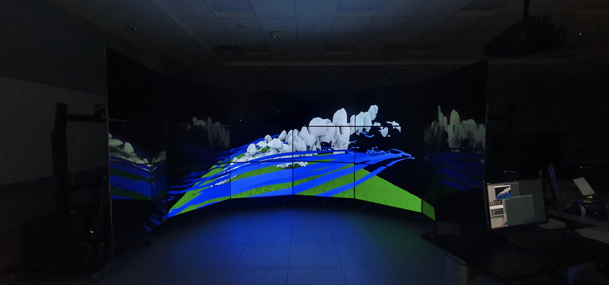
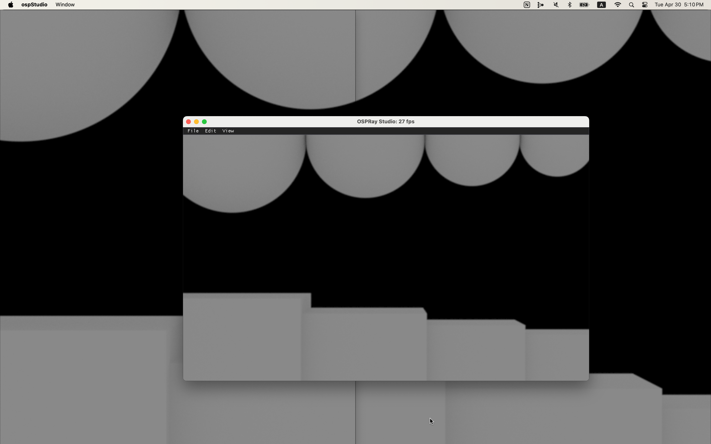

# Immersive OSPRay Studio
> This project is part of a larger project called [Immersive OSPray](https://github.com/jungwhonam/ImmersiveOSPRay).

 ## Overview


We extend [OSPRay v3.1.0](https://github.com/RenderKit/ospray/releases/tag/v3.1.0) to support these additional features:
* Support off-axis projection enabling us to display a single, coherent 3D virtual environemnt on non-planar, tiled-display walls
* Open multiple windows and arrange them based on specifications provided in a JSON file
* Synchronize application states across MPI processes


## Prerequisites
Make the CMake option `BUILD_OSPRAY_MODULE_MPI` is set to `ON` when building OSPRay, as this feature relies on [OSPRay’s MPI module](https://github.com/RenderKit/ospray?tab=readme-ov-file#mpi-distributed-rendering).

## Setup
```shell
# clone this branch
git clone -b jungwho.nam-feature-immersive-latest https://github.com/JungWhoNam/ospray_studio.git
cd ospray_studio

mkdir build
cd build
mkdir release
```

## CMake configuration and build
OSPRay Studio needs to be built with `-DUSE_MPI=ON` in CMake.

Additionally, make sure to use the OSPRay version you have built. After building OSPRay with `BUILD_OSPRAY_MODULE_MPI`, set `ospray_DIR` so CMake can locate OSPRay, e.g., `/Users/jnam/Documents/dev/ospray/build/release/install/ospray/lib/cmake/ospray-3.1.0`.

```shell
cmake -S .. \
-B release \
-DCMAKE_BUILD_TYPE=Release \
-DUSE_MPI=ON \
-Dospray_DIR="/Users/jnam/Documents/dev/ospray/build/release/install/ospray/lib/cmake/ospray-3.1.0"

cmake --build release

cmake --install release
```

## Run `ospStudio` with an example display setting


Run `ospStudio` with 3 ranks. Rank 0 will open a window and handle user inputs, as well as broadcast changes to other processes. Rank 1 and 2 will open windows without decorations such as a border, a close widget, etc. These two windows are placed right next to each other and utilize off-axis projection capabilities to appear as a single window. These specifications are written in the display setting file.

> Download [the example display setting file](./docs/sample//display_settings.json).

> Press 'r' to synchrnoize application states. 

> Press 'q' to quit the application.

```shell
mpirun -n 3 \
./release/ospStudio \
--mpi \
--scene multilevel_hierarchy \
--displayConfig display_settings.json
```

```--mpi```: This option enables the OSPRay Studio's built-in MPI support.

```--scene multilevel_hierarchy```: *(Optional)* this option starts the application with the scene opened.

````--displayConfig display_settings.json````: The JSON configuration file contains information about off-axis projection cameras and windows.

## Support other display settings
Modify the JSON file specificed in the `--displayConfig` flag. Additionally, adjust the number for `mpirun -n` accordingly.

> See [another example display setting file](./docs/sample/rattler.json) for the walls shown in the teaser image.