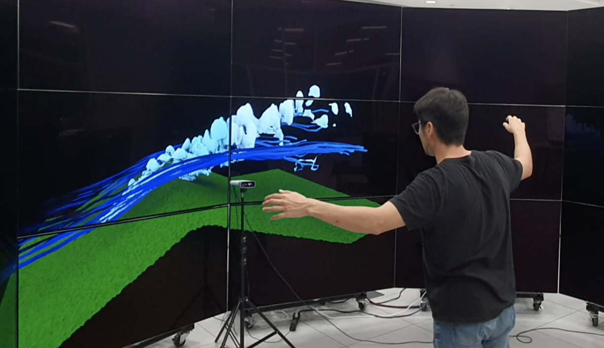
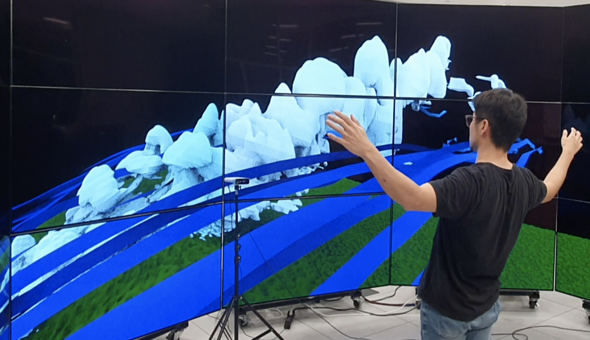
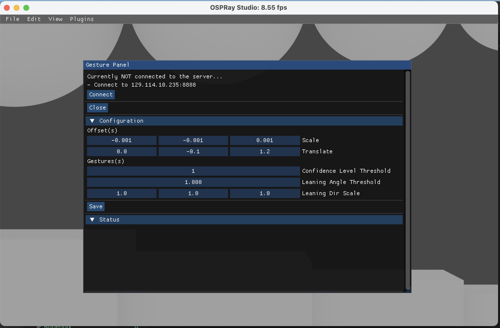
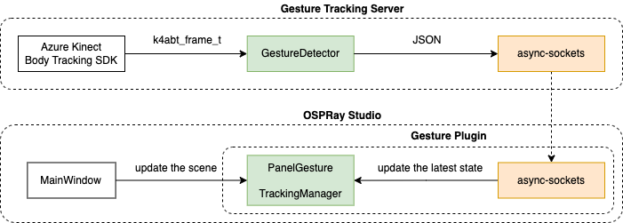

# Gesture interaction plugin for OSPRay Studio 
> This project is part of a larger project called [Immersive OSPray Studio](https://github.com/jungwhonam/ImmersiveOSPRay).

## Overview
<div id="image-table">
  <table>
    <td style="padding:6px">
      
    </td>
    <td style="padding:6px">
      
    </td>
  </table>
</div>

We created a plugin for [OSPRay Studio v1.0.0](https://github.com/RenderKit/ospray-studio/releases/tag/v1.0.0) allowing users to navigate a 3D virtual environment using gestures. Lifting both hands above a belly button triggers a flying mode. Once in the mode, the camera moves into a body-leaning direction.

<div id="image-table">
  <table>
    <td style="padding:6px">
      
    </td>
    <td style="padding:6px">
      
    </td>
  </table>
</div>

This plugin recieves the body tracking data from [Gesture Tracking Server](https://github.com/jungwhonam/GestureTrackingServer). After processing user inputs, such as key-pressed events, OSPRay Studio calls a method in the plugin to update GUIs. At this stage, the plugin retrieves the latest tracking result and use it to update relevant 3D objects, such as modifying camera positions.

## Prerequisites
Before running `ospStudio` with the plugin, you need to start [Gesture Tracking Server](https://github.com/jungwhonam/GestureTrackingServer).


## Setup
```shell
# clone this branch
git clone -b jungwho.nam-feature-plugin-gesture https://github.com/JungWhoNam/ospray_studio.git
cd ospray_studio

mkdir build
cd build
mkdir release
``` 


## CMake configuration and build
OSPRay Studio needs to be built with `-DBUILD_PLUGINS=ON` and `-DBUILD_PLUGIN_GESTURE=ON` in CMake.

```shell
cmake -S .. \
-B release \
-DCMAKE_BUILD_TYPE=Release \
-DBUILD_PLUGINS=ON \
-DBUILD_PLUGIN_GESTURE=ON

cmake --build release

cmake --install release
```


## Run `ospStudio` with the gesture plugin

1. First, start the server by following the steps written in [the server repo](https://github.com/jungwhonam/GestureTrackingServer).
2. Start `ospStudio` with the plugin.
```shell
./release/ospStudio \
--plugin gesture \
--plugin:gesture:config gesture_settings.json
```
1. Go to `Plugins` > `Gesture Panel` in the menu.
2. Click "Connect" button.

If connected, you will see "Connected to the server successfully" displayed on the Status sub-panel.


## Plugin configuration JSON file
When running `ospStudio`, you must specify the location of this JSON file using `--plugin:gesture:config` flag. This file contains information about the gesture tracking server and instructions on handling the tracking data.

```json
{
    "ipAddress": "127.0.0.1",
    "portNumber": 8888,
    
    "scaleOffset": [0.001, -0.001, -0.001],
    "translationOffset": [0.0, -0.1, 1.19],
    "confidenceLevelThreshold": 1,
    "leaningAngleThreshold": 1.0,
    "leaningDirScaleFactor": [1.0, 1.0, 1.0]
}
```
* `ipAddress` and `portNumber` are used for connecting the gesture tracking server.
* `scaleOffset` is multiplied to position values of joints to adjust for differences between Kinect and OSPRay Studio coordinate systems.
* `translationOffset` offsets the sensor's center to calibrate it with displays.
* `confidenceLevelThreshold` specifies the joint confidence level considered for processing, with different levels detailed in [Microsoft's documentation](https://microsoft.github.io/Azure-Kinect-Body-Tracking/release/1.1.x/namespace_microsoft_1_1_azure_1_1_kinect_1_1_body_tracking_adfff503ebc1491373c89e96887cad226.html#adfff503ebc1491373c89e96887cad226) for different levels.
* `leaningAngleThreshold` is a threshhold for activating the flying mode when a user's body leans beyond this angle.
* `leaningDirScaleFactor` sets the speed of camera movement based on body leaning direction.

> Here is [an example JSON file](./gesture_settings.json).